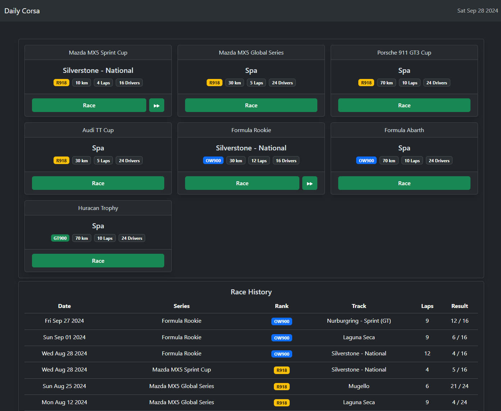

# Daily Corsa

Streamlined AI racing for Assetto Corsa.

https://gediminasz.github.io/ac/



## Development

Use a static file server for development, e.g.:

```
python -m http.server
```

## Release

1. Rebase `production` branch on `main`
1. Push `production` branch
1. Wait for GitHub Pages to update

## External links

- RSR Live Timing data : http://www.radiators-champ.com/RSRLiveTiming/index.php?page=rank
- Assetto Corsa Database: https://assetto-db.com
- Assetto Corsa Car Summary List: https://www.assettocorsa.net/forum/index.php?threads/assetto-corsa-car-summary-list.36112/
